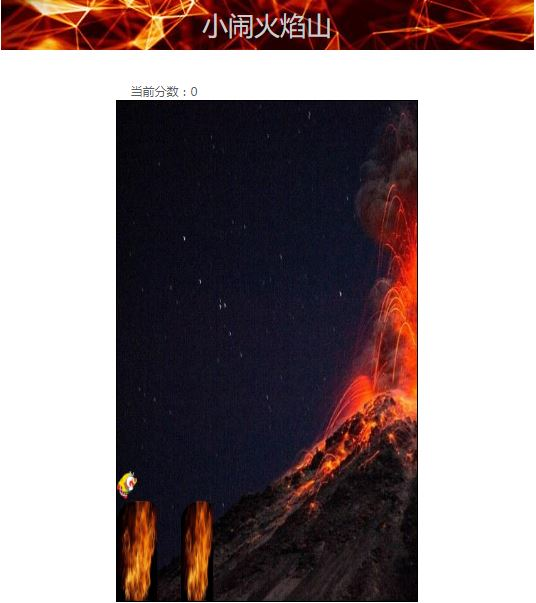
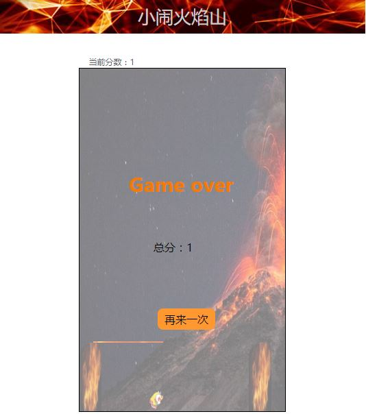

# mini-game
用原生js打造的悟空小闹火焰山小游戏

## 玩法
鼠标长按屏幕，金箍棒变长然后倒下搭到第二根柱子，悟空飞过去

## game over
金箍棒太长或者太短，悟空飞过去之后会掉下，游戏结束

## 项目地址
[https://github.com/HHardyy/mini-games](https://github.com/HHardyy/mini-games)

## 演示地址
[https://hhardyy.com/hero/hero.html](https://hhardyy.com/hero/hero.html)
(目前支持PC端)

## 游戏截图

